# Healthcare Revenue Cycle Management (RCM) — Full Technical Write-Up

## Table of Contents

1. [Domain Overview](#1-domain-overview)
2. [Business Scenario](#2-business-scenario)
3. [Medallion Architecture Overview](#3-medallion-architecture-overview)
4. [Data Sources](#4-data-sources)
5. [ADLS Gen2 Storage Structure](#5-adls-gen2-storage-structure)
6. [ADF Factory Structure](#6-adf-factory-structure)
7. [Landing Layer — Raw File Drop](#7-landing-layer--raw-file-drop)
8. [Bronze Layer — Ingestion](#8-bronze-layer--ingestion)
9. [Silver Layer — Transformation](#9-silver-layer--transformation)
10. [Gold Layer — Analytics](#10-gold-layer--analytics)
11. [Unity Catalog Structure](#11-unity-catalog-structure)

---

## 1. Domain Overview

**Revenue Cycle Management (RCM)** is the end-to-end financial process healthcare providers use to track patient care episodes — from appointment scheduling through to final payment collection.

The primary goal is to ensure hospitals receive timely and accurate payments while continuing to deliver quality patient care.

### High-Level RCM Workflow

```
1. Patient Registration and Visit
2. Service Delivery
3. Billing and Claim Submission
4. Claim Adjudication
5. Payment Collection and Follow-ups
```

### Financial Components

RCM focuses on two core financial areas:
- **Accounts Receivable (AR):** Core focus — money owed to the hospital by insurers and patients
- **Accounts Payable (AP):** Money the hospital owes to vendors and suppliers

---

## 2. Business Scenario

### Multi-Hospital Acquisition Problem

When one hospital acquires another, the following conflicts arise:

| Problem | Example |
|---|---|
| Different source databases | Hospital A uses one SQL schema, Hospital B uses another |
| Different column names | Hospital A has `patient_id`, Hospital B has `p_id` |
| ID conflicts | Both hospitals have `patient_id = 1` but they are different patients |

### Solution: Common Data Model (CDM)

To resolve this, the pipeline:
- Standardises column names across both hospitals by selecting each column with a standard alias so both hospitals produce identically named columns before being combined (Hospital B's `ID` is aliased as `PatientID`, `F_Name` as `FirstName`, `L_Name` as `LastName` — matching Hospital A's column names)
- Generates **surrogate keys** by combining the source ID with the hospital tag: `source_id + '-' + datasource` (e.g., `123-hosa`, `123-hosb`) to prevent ID collisions across facilities
- Tags every row with a `datasource` column (`hosa` or `hosb`)
- Enables cross-hospital analytics from a single unified table

---

## 3. Medallion Architecture Overview

The project uses Medallion Architecture on Azure.

| Layer | Storage | Format | Purpose |
|---|---|---|---|
| **Landing** | ADLS Gen2 (`landing` container) | Raw Files | External/client-dropped files. Not registered in Unity Catalog. |
| **Bronze** | ADLS Gen2 (`bronze` container) | Parquet | Raw structured data. Source of truth / system of record. Not registered in Unity Catalog. |
| **Silver** | Unity Catalog (`rcm_adb.silver`) | Delta Tables | Cleaned and standardised data. CDM and surrogate keys applied. SCD Type 2 implemented. Registered in Unity Catalog. |
| **Gold** | Unity Catalog (`rcm_adb.gold`) | Delta Tables | Analytics-ready Star Schema. Fact and dimension tables. Registered in Unity Catalog. |

Star Schema is used in the Gold layer:
- **Star Schema:** Central fact table connected to independent dimension tables. Faster queries, simpler BI reporting.
- **Snowflake Schema** (not used): Normalises dimensions into sub-dimensions. Reduces redundancy but increases query complexity.

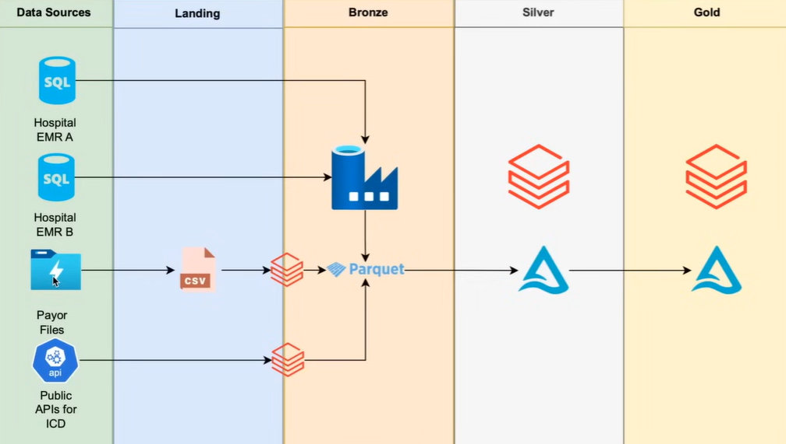

---

## 4. Data Sources

| # | Source | Flow | Target Bronze Path |
|---|---|---|---|
| 1 | EMR — Hospital A (`hosa`) | Azure SQL DB `hosa` → (ADF) → Bronze | `bronze/hosa/<tablename>/` |
| 2 | EMR — Hospital B (`hosb`) | Azure SQL DB `hosb` → (ADF) → Bronze | `bronze/hosb/<tablename>/` |
| 3 | Claims Data | Client → Landing → (Databricks) → Bronze | `bronze/claims/` |
| 4 | CPT Codes | Client → Landing → (Databricks) → Bronze | `bronze/cptcodes/` |
| 5 | NPI Data | CMS API → (Databricks) → Bronze | `bronze/npi_extract/` |
| 6 | ICD Codes | WHO ICD-10 API → (Databricks) → Bronze | `bronze/icd_codes/` |

### EMR Source — Azure SQL Tables

```
rcmsqlserver.database.windows.net
│
├── hosa  (Hospital A)
│   ├── dbo.patients       ← SCD2 in Silver
│   ├── dbo.providers      ← Full Load in Silver
│   ├── dbo.departments    ← Full Load in Silver
│   ├── dbo.transactions   ← SCD2 in Silver
│   └── dbo.encounters     ← SCD2 in Silver
│
└── hosb  (Hospital B)
    ├── dbo.patients       ← SCD2 in Silver
    ├── dbo.providers      ← Full Load in Silver
    ├── dbo.departments    ← Full Load in Silver
    ├── dbo.transactions   ← SCD2 in Silver
    └── dbo.encounters     ← SCD2 in Silver
```

---

## 5. ADLS Gen2 Storage Structure

```
Azure SQL DB (hosa/hosb)   ───────────────────┐
                                              │
Public APIs (NPI, ICD)     ───────────────────├──► Bronze ──► Silver ──► Gold ──► BI / Analytics
                                              │
Claims & CPT Data (CSV)    ──► Landing ───────┘
```

**Storage Account:** `rcmproject`

```
rcmproject  (ADLS Gen2 Storage Account)
│
├── landing/                          ← Client drops raw files here (Claims and CPT data)
│   ├── claims/                       ← hospital1_claims.csv, hospital2_claims.csv
│   └── cptcodes/                     ← CPT code CSV files
│
├── bronze/                           ← Raw data, Parquet format, source of truth
│   │
│   ├── hosa/                         ← Hospital A EMR (ADF from Azure SQL hosa DB)
│   │   ├── patients/
│   │   │   ├── patients              ← Current Parquet file
│   │   │   └── archive/
│   │   │       └── 2026/02/07/
│   │   │           └── patients      ← Previous load archived here
│   │   ├── providers/
│   │   ├── departments/
│   │   ├── transactions/
│   │   └── encounters/
│   ├── hosb/                         ← Hospital B EMR (same structure as hosa)
│   │   ├── patients/
│   │   ├── providers/
│   │   ├── departments/
│   │   ├── transactions/
│   │   └── encounters/
│   ├── claims/                       ← Parquet (overwrite)
│   ├── cptcodes/                     ← Parquet (overwrite)
│   ├── npi_extract/                  ← Parquet (overwrite)
│   └── icd_codes/                    ← Parquet (append)
│
└── configs/                          ← Pipeline control files (outside Medallion)
    └── emr/
        └── load_config.csv           ← Metadata-driven pipeline control table
```

---

## 6. ADF Factory Structure

```
rcmadfdevanon  (Azure Data Factory)
│
├── Linked Services                     ← Define HOW ADF connects to each external system
│   ├── ls_adls                         → ADLS Gen2 (rcmproject): reads/writes Parquet and CSV
│   ├── ls_sql_db                       → Azure SQL Server (rcmsqlserver): parameterised by db_name
│   ├── ls_adb_audit                    → Databricks Delta Lake (cluster: rcm): reads/writes audit.load_logs
│   └── ls_adb_notebooks                → Databricks Workspace (cluster: rcm): triggers notebook runs
│
├── Datasets                            ← Define WHAT data to read/write (built on linked services)
│   ├── ds_azureSql                     → Reads any Azure SQL table dynamically (params: db_name, schema_name, table_name)
│   ├── ds_adls_flat_file               → Reads CSV files from ADLS (params: container, file_path, file_name)
│   ├── ds_adls_parquet_file            → Reads/writes Parquet in ADLS (params: container, file_path, file_name)
│   └── ds_adb                          → Reads/writes a Databricks Delta table (params: schema_name, table_name)
│
└── Pipelines
    │
    └── pl_main_e2e                     → Master pipeline: triggers all others end-to-end
        │
        ├── pl_emr_src_to_bronze        → Child (parallel): reads load_config.csv, loops EMR tables,
        │   │                             archives old files, checks active flag, calls grandchild
        │   │
        │   └── pl_copy_from_emr        → Grandchild: Full / Incremental copy from SQL DB to Bronze,
        │                                 logs to audit.load_logs
        │
        ├── pl_others_scr_to_bronze     → Child (parallel): triggers 3 Databricks notebooks in parallel
        │                                 (Claims/CPT from Landing, NPI from CMS API, ICD from WHO API)
        │
        └── pl_slv_to_gold              → Child: runs after BOTH bronze pipelines succeed.
                                          Triggers all Silver notebooks (parallel), then Gold notebooks
                                          (each after its Silver dependency)
```

**Parameter flow hierarchy:** `Pipeline → Dataset → Linked Service`
Every Dataset must reference a Linked Service; a Dataset cannot exist without one.

Linked service = the road to a building. It defines HOW to reach a data source.
Dataset = the specific room inside the building. It points to the exact data.

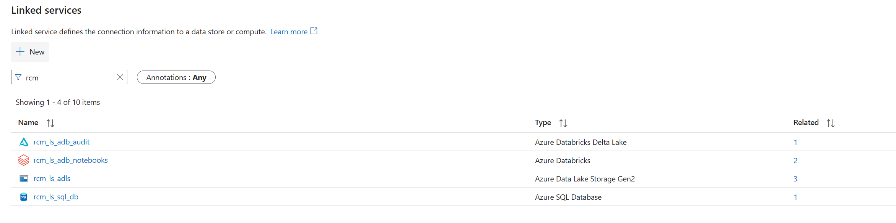
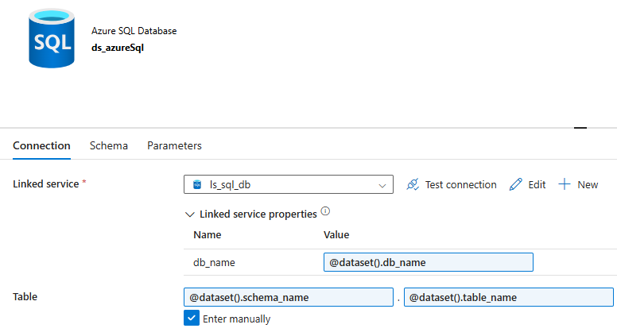
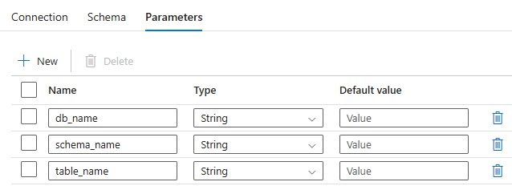

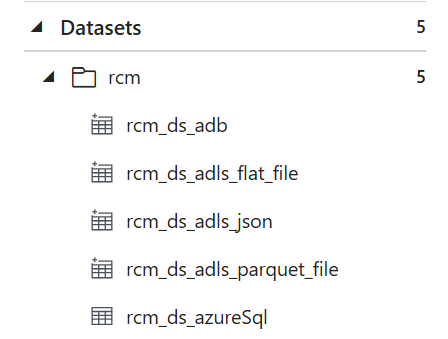
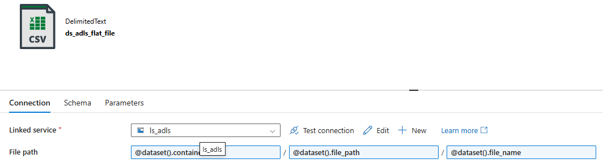
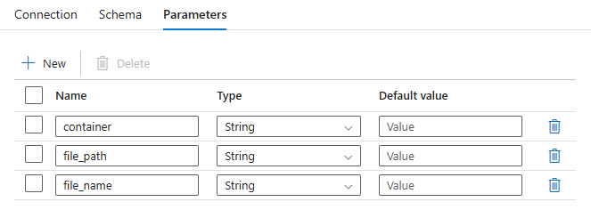

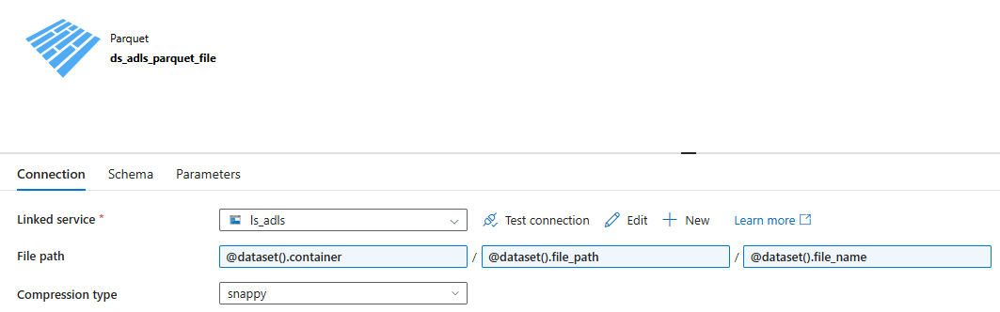
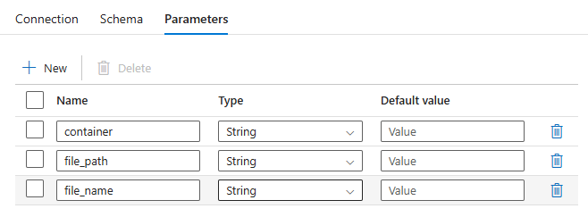

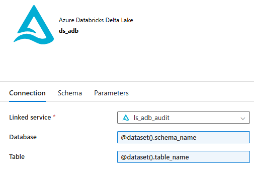
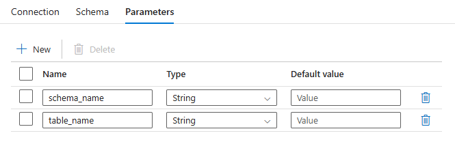

---

### Pipeline Execution Flow

```
┌──────────────────────────────────────────────────────────────────────────┐
│ pl_main_e2e                                                              │
│                                                                          │
│  ┌──────────────────────────────────┐                                    │
│  │ pl_emr_src_to_bronze             │ ──┐                                │
│  │   └─► [pl_copy_from_emr]         │   │  on success                    │
│  └──────────────────────────────────┘   ├─────────────► [pl_slv_to_gold] │
│                                         │  of both                       │
│  ┌──────────────────────────────────┐   │                                │
│  │ pl_others_scr_to_bronze          │ ──┘                                │
│  └──────────────────────────────────┘                                    │
│                                                                          │
└──────────────────────────────────────────────────────────────────────────┘
```


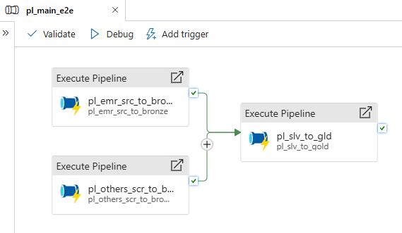

---

## 7. Landing Layer — Raw File Drop

The Landing layer is a staging area in ADLS for files that arrive externally before being processed into Bronze. It is not part of the Medallion layers — it sits before Bronze.

### What Lands Here

| Source | Container/Path | How It Arrives |
|---|---|---|
| Claims data | `landing/claims/` | Dropped manually or via external feed |
| CPT codes | `landing/cptcodes/` | Dropped manually or via external feed |

### How It Flows to Bronze

A Databricks notebook (triggered by `pl_others_scr_to_bronze`) reads from Landing and writes Parquet to Bronze:

```
landing/claims/     →  (Databricks notebook)  →  bronze/claims/
landing/cptcodes/   →  (Databricks notebook)  →  bronze/cptcodes/
```

No transformation occurs at this stage. It is a straight copy with schema enforcement, hospital tagging (via filename), and audit columns added.

---

## 8. Bronze Layer — Ingestion

Bronze ingestion is orchestrated by `pl_main_e2e`, which triggers two child pipelines in parallel:

| Pipeline | Triggered By | What It Does |
|---|---|---|
| `pl_emr_src_to_bronze` | `pl_main_e2e` | Reads EMR tables from Azure SQL DB, writes Parquet to Bronze via ADF Copy activities |
| `pl_others_scr_to_bronze` | `pl_main_e2e` | Triggers 3 Databricks notebooks in parallel: Claims/CPT from Landing, NPI from CMS API, ICD from WHO API |

---

### 8.1 EMR Data — Azure SQL DB to Bronze (`pl_emr_src_to_bronze`)

**Scope:** This pipeline and its control file are used exclusively for EMR data ingestion from Azure SQL DB into Bronze.

- `load_config.csv` — ADLS: `configs/emr/load_config.csv`
  Controls which EMR table to ingest, from which hospital, whether it is active, and the load type (Full or Incremental).
- `audit.load_logs` — Unity Catalog: `rcm_adb.audit.load_logs`
  After each load, records row count, watermark column, and load timestamp. On the next incremental run, the previous timestamp is read to determine which rows are new.

This metadata-driven pipeline ingests all EMR tables from both hospitals into ADLS Bronze. Before writing, it archives any existing Parquet file to a dated subfolder.

#### End-to-End Execution Flow

```
Step 1: Read load_config.csv  (Lookup: emr_config)
↓
Step 2: ForEach all config rows  (emr_config_row — parallel, batchCount: 5)
    ↓
    Step 3: Check if Parquet file already exists in Bronze  (GetMetadata: bronze_file_exists)
        ↓
        [True]  → Archive existing ADLS file  (Copy: archive)
                  → bronze/<path>/archive/yyyy/MM/dd/
        [False] → Skip archiving
        ↓
    Step 4: Check is_active flag  (IfCondition: active_flag)
        ↓
        [True]  → Call grandchild pipeline  (ExecutePipeline: pl_copy_from_emr)
        [False] → Skip this table entirely
        ↓
    Step 5: Inside pl_copy_from_emr — Check load type  (IfCondition: load_type)
        ↓
        [Full]        → full_load  → full_load_log
        [Incremental] → last_load_date  → incremental_load  → incremental_load_logs
```

#### Step-by-Step Activity Details

**Step 1 — Read Config (Lookup: `emr_config`)**
Reads `load_config.csv` from ADLS. Returns all rows (`firstRowOnly: false`). Each row represents one table from one hospital, with load type, watermark column, and active flag.

**Step 2 — Loop through each config row (`emr_config_row`)**
ForEach iterates over every config row with `batchCount: 5` and `isSequential: false`, processing up to 5 tables in parallel.

**Step 3 — Check Bronze file existence (`bronze_file_exists`)**
GetMetadata checks whether a Parquet file already exists at the Bronze path for the current table. The result drives the archival decision.

**Step 4 — Archive old file if it exists (`if_bronze_file_exists`)**
If found, the existing Parquet is copied to a dated archive path before new data arrives:
`bronze/<entity>/archive/2026/02/07/<tablename>`
If no file exists (first-ever run for this table), archiving is skipped.

**Step 5 — Check active flag (`active_flag`)**
If `is_active = 0`, the table is skipped entirely. If `is_active = 1`, `pl_copy_from_emr` is called with all config row parameters.

**Step 5.1 — Full Load path**
The entire table is copied from Azure SQL DB to Bronze as Parquet (overwrite). A `datasource` column is added to tag the hospital. Row count and timestamp are logged to the audit table.

**Step 5.2 — Incremental Load path**
The pipeline reads the maximum `loaddate` from `rcm_adb.audit.load_logs` for this table and datasource. Defaults to `1900-01-01` on the first run (effectively a full load). Copies only rows where the watermark column is greater than or equal to the last load date. Updates the audit table after copy.


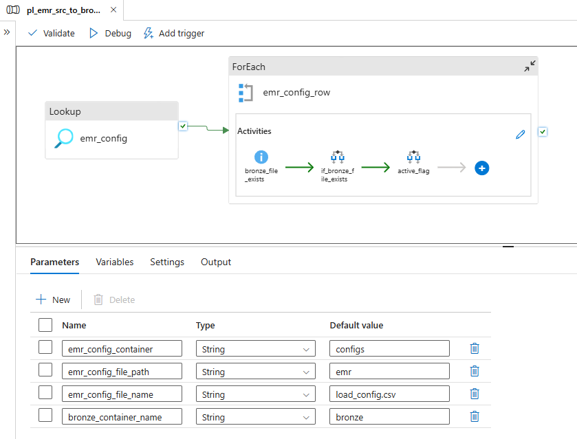


#### How Incremental Loading Works Across Runs

**First run:**
`rcm_adb.audit.load_logs` has no record for this table. The pipeline defaults to `1900-01-01` as the last load date, returning all rows. After copying, the current timestamp is saved.

**Every subsequent run:**
The pipeline reads the timestamp from the previous run and queries only rows where the watermark column is greater than or equal to that date. Only new or updated rows are copied. The audit table is updated with the new timestamp.

**Why this works:**
The audit table acts as a persistent memory for the pipeline. Each run knows exactly where the last run left off without requiring any pipeline code changes.

---

### 8.2 Claims, CPT, NPI, and ICD — Landing and APIs to Bronze (`pl_others_scr_to_bronze`)

Three notebooks triggered in parallel via ADF `DatabricksNotebook` activities using `ls_adb_notebooks`.

**Notebook 1 — `Landing to Bronze - Claims Data & CPT Codes.py`**

Reads all CSVs from `landing/claims/` and `landing/cptcodes/`. For Claims, the source filename determines the hospital tag (`hospital1` → `hosa`, `hospital2` → `hosb`). For CPT Codes, column names are normalised (lowercase, underscores). Audit columns (`inserted_date`, `updated_date`) are added to both. Writes Parquet to Bronze (overwrite).

**Notebook 2 — `API extract NPI codes.py`**

Calls the public CMS NPI Registry API for Los Angeles, CA (up to 20 results). For each NPI returned, makes a detail call to retrieve provider name, position, and organisation. Handles both individual providers (NPI-1) and organisations (NPI-2). Writes Parquet to `bronze/npi_extract/` (overwrite).

**Notebook 3 — `API extract ICD codes.py`**

Authenticates with the WHO ICD-10 API using OAuth2 (client credentials flow). Recursively fetches all codes under category `A00-A09` (intestinal infectious diseases). Writes Parquet to `bronze/icd_codes/` in append mode — new codes accumulate on each run rather than replacing existing ones.


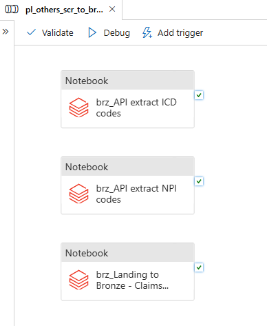

---

## 9. Silver Layer — Transformation

Silver is triggered by `pl_slv_to_gold`. All 9 Silver notebooks run in parallel. Silver reads Parquet from ADLS Bronze and writes cleaned, standardised Delta tables to Unity Catalog (`rcm_adb.silver`).

### Common Pattern Across All Silver Notebooks

**Step 1 — Read Bronze Parquet from ADLS**
Every Silver notebook reads the full current Bronze Parquet on each run (no incremental logic in Silver). EMR tables read from both `hosa` and `hosb` paths separately. Archived files are never read.

**Step 2 — Apply CDM (Common Data Model)**
Each hospital's dataframe has its columns renamed to a standard schema. Hospital B's non-standard names are aliased to match Hospital A's schema. A surrogate key is created: `source_id + '-' + datasource`.

**Step 3 — Combine both hospitals (EMR tables only)**
Both hospital dataframes are unioned using `unionByName()` into a single combined dataframe.

**Step 4 — Create a Temp View**
A named temp view is created from the CDM-standardised data, making it queryable with Spark SQL in subsequent steps.

**Step 5 — Apply Quality Checks**
A second temp view (`quality_checks`) is created, adding an `is_quarantined` flag to every row. Rows with null or invalid key fields are flagged `true`. Quarantined rows are not dropped — they are written to Silver for investigation.

**Step 6 — Write to Silver Delta Table**
Two strategies:
- **Full Load (Departments, Providers):** Silver table is emptied and all rows are inserted fresh on every run.
- **SCD Type 2 (all other tables):** Two-step MERGE. Step 1 sets `is_current = false` and updates `audit_modifieddate` on records where any business column has changed. Step 2 inserts new active versions (`is_current = true`) for records that are new or have been changed.

### SCD Type 2 Audit Columns

| Column | Meaning |
|---|---|
| `is_current` | `true` = latest active version. `false` = historical version retained for audit. |
| `audit_insertdate` | Timestamp when this version was first written to Silver. |
| `audit_modifieddate` | Timestamp when this version was last expired (set to `is_current = false`). |

### Hospital B CDM Column Mapping (Patients example)

| Hospital B Column | Standardised Name |
|---|---|
| `ID` | `PatientID` |
| `F_Name` | `FirstName` |
| `L_Name` | `LastName` |
| `M_Name` | `MiddleName` |
| `Updated_Date` | `ModifiedDate` |

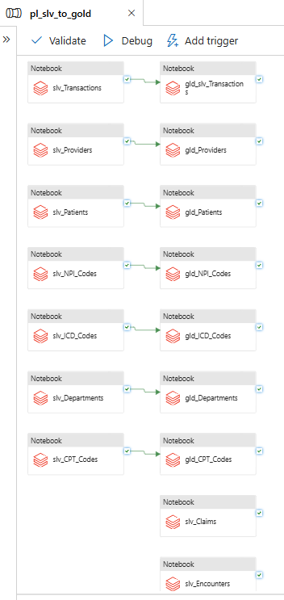

---

## 10. Gold Layer — Analytics

Gold is also triggered by `pl_slv_to_gold`. Each Gold notebook executes after its corresponding Silver notebook succeeds. Gold reads from Silver Delta tables in Unity Catalog and writes to Gold Delta tables — also in Unity Catalog (`rcm_adb.gold`).

Gold is a **Star Schema** — one central fact table surrounded by independent dimension tables.

### Common Pattern

Every Gold notebook truncates its table and reloads from Silver on every run. Gold always reflects the latest clean snapshot — no history is preserved here.

**Dimension tables** each read only current (`is_current = true`), non-quarantined records from their Silver table and write to the corresponding Gold dimension. They are independent of each other.

**Fact table** (`fact_transactions`) reads from `silver.transactions` and constructs FK columns whose values match the PKs already in the dimension tables, enabling BI tools to join at query time:
- `FK_PatientID = PatientID + datasource` → matches `dim_patient.Patient_Key`
- `FK_DeptID = DeptID + datasource` → matches `dim_department.Dept_Key`
- `FK_ProviderID = H1-/H2- prefix + ProviderID` → matches `dim_provider.Provider_Key`

### Star Schema Design

```
dim_patient ───────┐
dim_provider ──────┤
dim_department ────┤
dim_cpt_code ──────┤─── fact_transactions
dim_icd_code ──────┤
dim_npi ───────────┘
```

The fact table holds the financial transaction record. Each foreign key links to a dimension table for business context.

---

## 11. Unity Catalog Structure

**Catalog:** `rcm_adb`

```
rcm_adb  (Unity Catalog)
│
├── audit
│   └── load_logs                     ← Pipeline execution log / incremental watermark table
│
├── silver
│   ├── patients                      ← SCD2
│   ├── transactions                  ← SCD2
│   ├── encounters                    ← SCD2
│   ├── claims                        ← SCD2
│   ├── cptcodes                      ← SCD2
│   ├── icd_codes                     ← SCD2
│   ├── npi_extract                   ← SCD2
│   ├── providers                     ← Full Load (Truncate/Insert)
│   └── departments                   ← Full Load (Truncate/Insert)
│
└── gold
    ├── dim_patient
    ├── dim_provider
    ├── dim_department
    ├── dim_cpt_code
    ├── dim_icd_code
    ├── dim_npi
    └── fact_transactions
```

### `audit.load_logs` Schema

| Column | Description |
|---|---|
| `data_source` | Hospital tag (`hosa` or `hosb`) |
| `tablename` | Fully qualified table name (e.g., `dbo.patients`) |
| `numberofrowscopied` | Row count from the ADF Copy activity |
| `watermarkcolumnname` | Column used for incremental filtering (e.g., `ModifiedDate`) |
| `loaddate` | UTC timestamp of the load — used as the next incremental cutoff |
