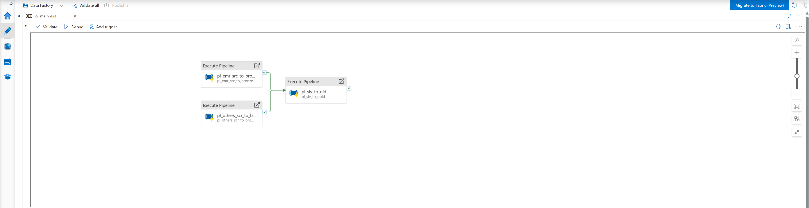
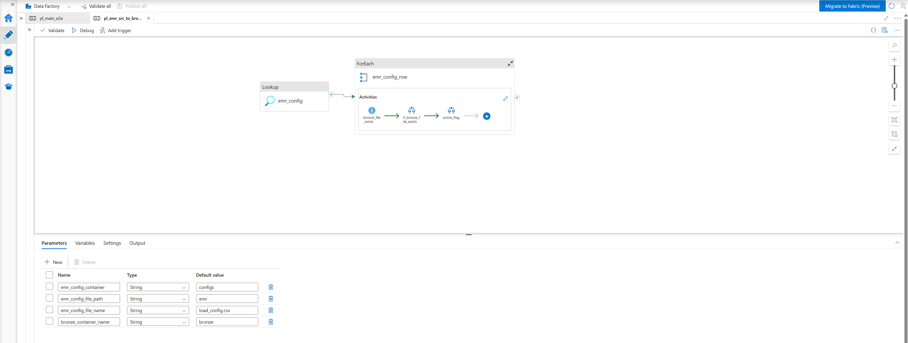
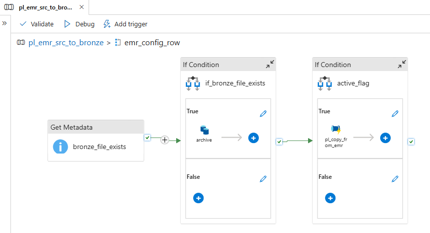
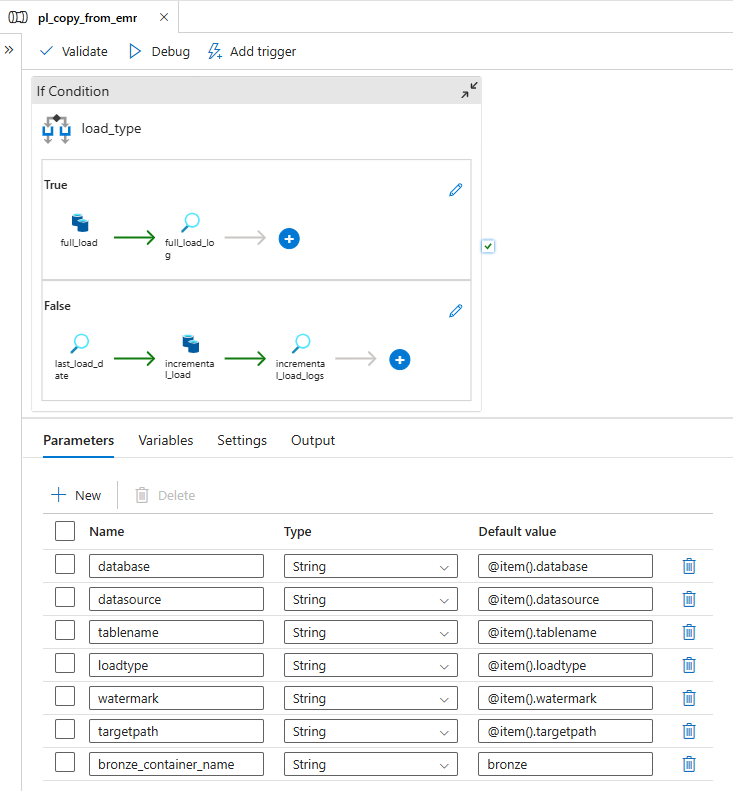
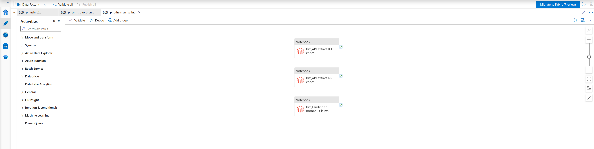
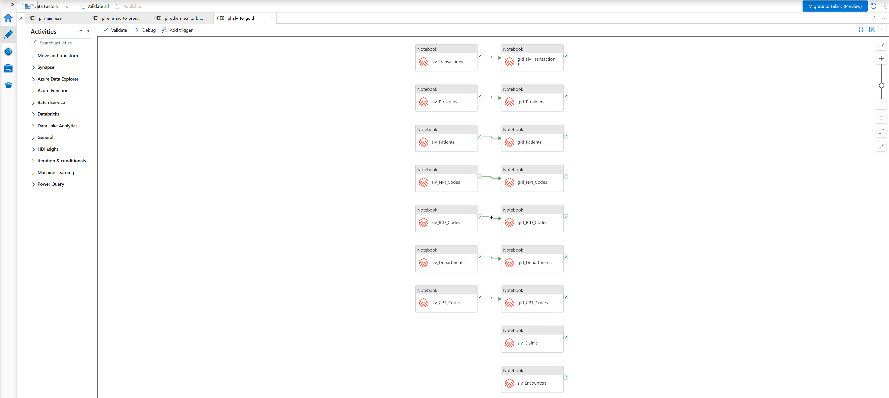

# ADF Pipelines

Azure Data Factory pipeline definitions exported as JSON. These files contain the full activity configuration for each pipeline stage, including activity chains, expressions, parameters, and dependency conditions.

To import into your own ADF instance: `Author > Pipelines > ... > Import from JSON`. After import, update all linked service references (`ls_adls`, `ls_sql_db`, `ls_adb_audit`, `ls_adb_notebooks`) and dataset references (`ds_azureSql`, `ds_adls_flat_file`, `ds_adls_parquet_file`, `ds_adb`) to match your environment.

---

## Pipeline Inventory

### `pl_main_e2e.json` — Master Pipeline

The top-level orchestrator. Runs the full end-to-end pipeline from Bronze ingestion through to Gold.

**Activity sequence:**

1. **ExecutePipeline: `pl_emr_src_to_bronze`** — Triggers the EMR ingestion child pipeline (no dependency; starts immediately)
2. **ExecutePipeline: `pl_others_scr_to_bronze`** — Triggers the non-EMR ingestion child pipeline (no dependency; runs in parallel with step 1)
3. **ExecutePipeline: `pl_slv_to_gold`** — Triggers the Silver and Gold transformation pipeline. Depends on **both** `pl_emr_src_to_bronze` and `pl_others_scr_to_bronze` succeeding before it starts.

---

### `pl_emr_src_to_bronze.json` — EMR Source to Bronze

Metadata-driven child pipeline that ingests all configured EMR tables from both hospital Azure SQL databases into ADLS Bronze as Parquet files.

**Parameters:**

| Parameter | Default | Description |
|---|---|---|
| `emr_config_container` | `configs` | ADLS container for the config file |
| `emr_config_file_path` | `emr` | Path within the container |
| `emr_config_file_name` | `load_config.csv` | Config file name |
| `bronze_container_name` | `bronze` | Target ADLS container |

**Activity sequence:**

1. **Lookup: `emr_config`** — Reads all rows from `load_config.csv` (`firstRowOnly: false`). Returns the full list of EMR tables with their load config.
2. **ForEach: `emr_config_row`** — Iterates over each config row in parallel (`batchCount: 5`, `isSequential: false`). Steps 3 to 5 execute inside this loop.
3. **GetMetadata: `bronze_file_exists`** — Checks whether a Parquet file already exists at the Bronze target path for this table.
4. **IfCondition: `if_bronze_file_exists`** — If the file exists, runs the `archive` Copy activity to move it to a dated subfolder (`bronze/<path>/archive/yyyy/MM/dd/`). If not, skips archiving.
5. **IfCondition: `active_flag`** — Checks `is_active` from the config row. If `1`, calls `pl_copy_from_emr` via `ExecutePipeline` and passes all config row parameters. If `0`, skips the table.

---

### `pl_copy_from_emr.json` — Copy from EMR (Grandchild)

Grandchild pipeline that performs the actual Full or Incremental copy from Azure SQL DB to Bronze. Called by `pl_emr_src_to_bronze` for each active config row.

**Parameters:**

| Parameter | Description |
|---|---|
| `database` | Azure SQL database name (`hosa` or `hosb`) |
| `datasource` | Hospital tag appended to each row (`hosa` or `hosb`) |
| `tablename` | Fully qualified table name (`dbo.patients`, etc.) |
| `loadtype` | `Full` or `Incremental` |
| `watermark` | Column used for incremental filtering (e.g., `ModifiedDate`) |
| `targetpath` | ADLS Bronze path for this table |
| `bronze_container_name` | `bronze` |

**Activity sequence:**

1. **IfCondition: `load_type`** — Branches on `loadtype` parameter.

**Full Load branch (`Full`):**

- **Copy: `full_load`** — Queries the full Azure SQL table (`SELECT *, '<datasource>' AS datasource FROM <tablename>`), writes to Bronze as Parquet (overwrite).
- **Lookup: `full_load_log`** — Inserts a row into `rcm_adb.audit.load_logs` with `data_source`, `tablename`, `numberofrowscopied`, `watermarkcolumnname`, and `loaddate`.

**Incremental Load branch (`Incremental`):**

- **Lookup: `last_load_date`** — Queries `rcm_adb.audit.load_logs` for the maximum `loaddate` for this `data_source` and `tablename`. Returns `1900-01-01` if no prior record exists (first run behaviour).
- **Copy: `incremental_load`** — Queries Azure SQL for rows where the watermark column is greater than or equal to `last_load_date`, appends the `datasource` tag, writes to Bronze as Parquet (overwrite).
- **Lookup: `incremental_load_logs`** — Inserts a new audit log row with the current run's row count and timestamp.

---

### `pl_others_scr_to_bronze.json` — Others Source to Bronze

Child pipeline that runs in parallel with `pl_emr_src_to_bronze`. Triggers three Databricks notebooks via ADF `DatabricksNotebook` activities using the `ls_adb_notebooks` linked service. All three notebook activities run in parallel (no dependencies between them).

**Activity sequence:**

1. **DatabricksNotebook: `Landing to Bronze - Claims Data & CPT Codes`** — Reads Claims and CPT CSV files from the ADLS Landing zone, adds a `datasource` tag (derived from the source filename), and writes Parquet to Bronze.
2. **DatabricksNotebook: `API extract NPI codes`** — Calls the CMS NPI Registry public API for Los Angeles, CA; extracts provider details for each NPI number returned; writes Parquet to `bronze/npi_extract/`.
3. **DatabricksNotebook: `API extract ICD codes`** — Authenticates with the WHO ICD-10 API via OAuth2, recursively fetches codes under category `A00-A09`, and writes Parquet to `bronze/icd_codes/` (append mode).

---

### `pl_slv_to_gold.json` — Silver to Gold

Child pipeline triggered after both Bronze pipelines succeed. Uses `ls_adb_notebooks` to run all Silver and Gold Databricks notebooks via `DatabricksNotebook` activities.

**Activity sequence:**

Silver notebooks (all 9 run in parallel with no dependencies between them):

| Activity | Notebook Path | Load Type |
|---|---|---|
| `slv_Patients` | `/rcm/03 Silver/Patients` | SCD Type 2 |
| `slv_Transactions` | `/rcm/03 Silver/Transactions` | SCD Type 2 |
| `slv_Encounters` | `/rcm/03 Silver/Encounters` | SCD Type 2 |
| `slv_Claims` | `/rcm/03 Silver/Claims` | SCD Type 2 |
| `slv_CPT_Codes` | `/rcm/03 Silver/CPT_Codes` | SCD Type 2 |
| `slv_ICD_Codes` | `/rcm/03 Silver/ICD_Codes` | SCD Type 2 |
| `slv_NPI_Codes` | `/rcm/03 Silver/NPI_Codes` | SCD Type 2 |
| `slv_Providers` | `/rcm/03 Silver/Providers` | Full Load |
| `slv_Departments` | `/rcm/03 Silver/Departments` | Full Load |

Gold notebooks (each depends on its corresponding Silver notebook succeeding):

| Activity | Notebook Path | Depends On |
|---|---|---|
| `gld_Patients` | `/rcm/04 Gold/dim_patient` | `slv_Patients` |
| `gld_Providers` | `/rcm/04 Gold/dim_provider` | `slv_Providers` |
| `gld_Departments` | `/rcm/04 Gold/dim_department` | `slv_Departments` |
| `gld_CPT_Codes` | `/rcm/04 Gold/dim_cpt_code` | `slv_CPT_Codes` |
| `gld_ICD_Codes` | `/rcm/04 Gold/dim_icd_code` | `slv_ICD_Codes` |
| `gld_NPI_Codes` | `/rcm/04 Gold/dim_npi` | `slv_NPI_Codes` |
| `gld_slv_Transactions` | `/rcm/04 Gold/fact_transaction` | `slv_Transactions` |

---

## ADF Naming Convention

All pipeline names follow the pattern `pl_{scope}_{description}`:

| Prefix | Meaning |
|---|---|
| `pl_main_` | Master pipeline (top-level orchestrator) |
| `pl_emr_` | Child pipeline scoped to EMR data |
| `pl_copy_` | Grandchild pipeline for copy logic |
| `pl_others_` | Child pipeline for non-EMR sources |
| `pl_slv_to_` | Child pipeline for Silver and Gold transformation |
