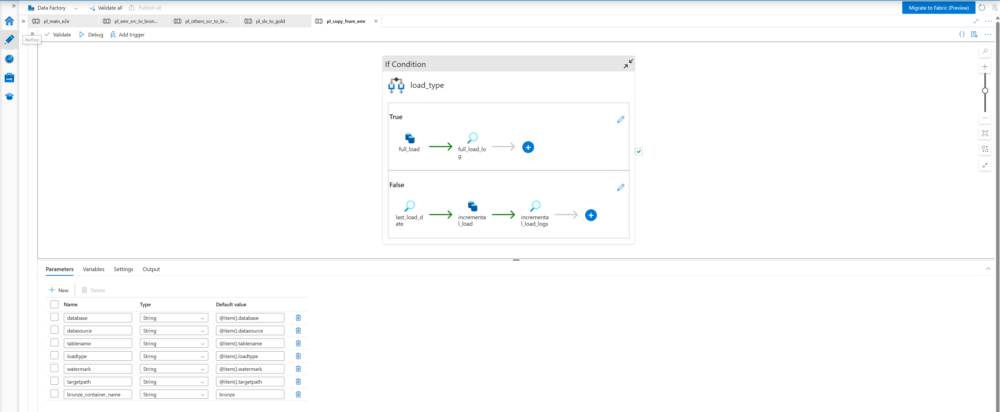

# Screenshots

Pipeline canvas diagrams, ADF configuration views, and Databricks workspace screenshots for the Healthcare RCM data pipeline.

---

## Architecture

### Medallion Architecture Overview

High-level diagram of the four-layer Medallion Architecture: Landing (CSV files), Bronze (Parquet, source of truth), Silver (Delta, CDM + SCD2), and Gold (Delta, Star Schema analytics).

---

## ADF — Pipeline Canvases

### Master Pipeline (`pl_main_e2e`)

End-to-end orchestration canvas. `pl_emr_src_to_bronze` and `pl_others_scr_to_bronze` run in parallel. `pl_slv_to_gold` is gated on both succeeding.

---

### EMR Source to Bronze (`pl_emr_src_to_bronze`)

Metadata-driven pipeline canvas: Lookup reads `load_config.csv`, ForEach iterates over config rows (batchCount: 5), GetMetadata checks Bronze file existence, IfCondition archives old file if exists, IfCondition checks `is_active` flag, and ExecutePipeline calls `pl_copy_from_emr`.

---

### Copy from EMR (`pl_copy_from_emr`)

Grandchild pipeline canvas showing the Full Load path (Copy activity + audit log Lookup) and the Incremental Load path (Lookup for last load date, Copy activity with watermark filter, audit log Lookup).

---

### Others Source to Bronze (`pl_others_scr_to_bronze`)

Canvas showing three parallel DatabricksNotebook activities: Claims and CPT from Landing, NPI from CMS API, and ICD codes from WHO API. All three run concurrently with no dependency between them.

---

### Silver to Gold (`pl_slv_to_gold`)

Canvas showing all 9 Silver notebook activities running in parallel, followed by 7 Gold notebook activities each depending on its corresponding Silver notebook.

---

## ADF — Factory Configuration

### Linked Services

Configured connections to ADLS Gen2 (`ls_adls`), Azure SQL Server parameterised by `db_name` (`ls_sql_db`), Databricks Delta Lake for audit table reads/writes (`ls_adb_audit`), and Databricks Workspace for notebook triggers (`ls_adb_notebooks`).

---

### Datasets

Dataset definitions: `ds_azureSql` for dynamic Azure SQL table reads, `ds_adls_flat_file` for CSV reads from ADLS, `ds_adls_parquet_file` for Parquet reads/writes in ADLS (used for Bronze and archival), and `ds_adb` for Databricks Delta table reads/writes (audit log).

---

### ADF Factory Overview

ADF factory structure showing all linked services, datasets, and pipeline folders in the `rcm` factory.

---

### ADF Pipelines List

All five pipelines registered under the `rcm` folder in the ADF factory.

---

## Databricks — Silver Layer

### SCD Type 2 — Silver Tables

Silver layer overview showing Unity Catalog Delta tables for all 9 entities, with `is_current`, `audit_insertdate`, and `audit_modifieddate` SCD2 columns visible in the schema.

